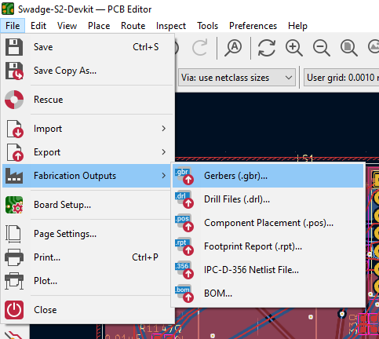
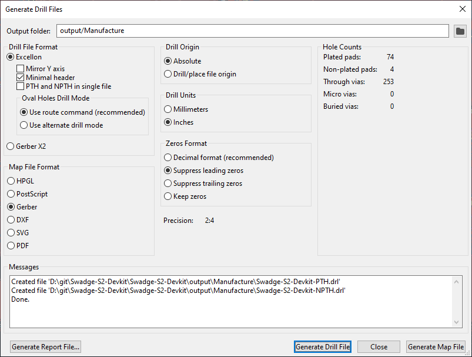

# Creating a Request for Quotation (RFQ) for Manufacturing

Magfest has used [Elecrow](https://www.elecrow.com/) for manufacturing the past few Swadges.

Screenshots were captured using KiCad 6.0.0 on Windows 10.

1. Validate the schematic.  
    1. Visually inspect the schematic. Look for things like missed connections or inconsistent labels.
    1. Run Electrical Rules Check (ERC). Make sure that any errors or warnings are either fixed or understood and accepted.  
    
	1. Edit symbols fields for verification.  
      
    Make sure that:
	    * Each symbol has an appropriate value (resistance, capacitance, etc.).
	    * Each symbol has a Digikey or LCSC identifier. Generic passives (resistors & capacitors) do not need identifiers. Footprints witout parts (like a PCIe edge connetor) do not need identifiers either.
		* Each symbol has the corret footprint.
		* Each symbol has appropriate notes (things like DNP [Do Not Populate] or if pins require a jumper).
		* Each part is in stock somewhere. This matters more for unique parts, not passives like resistors and capacitors.

        If a symbol is missing a field, consider adding it to the Swadge Parts library and updating the symbol from the library, rather than updating the symbol in the schematic.
1. Export the schematic.
    1. Open up the Plot menu.  
    
    1. Plot a PDF of all the pages using these options into the `.\output` folder. This folder is relative to your KiCad project and will be used for all exports.  
    
    1. Rename the PDF to have "-schematic" in the filename, like "EXAMPLE_PROJECT-schematic.pdf".
1. Export the BOM.
    1. Open up the BOM export.  
        
	1. Export using the default `bom_csv_grouped_by_value` script.  
        
	1. Open generated CSV file.
	1. Delete the header and "Individual Components" sections, leaving only the "Collated Components" and move that to the top of the CSV.
	1. Delete all columns except for:  
        | Item | Qty | Reference(s) | Value | Footprint | Digikey | LCSC | Notes | Substitutable |
        |------|-----|--------------|-------|-----------|---------|------|-------|---------------|
	1. In the CSV, replace the text `"Swadge_Parts:"` with `""`
	1. Save the CSV, rename it to have "-BOM" in the filename, like "EXAMPLE_PROJECT-BOM.csv", and move it to the `output` folder.
1. Validate the PCB.  
    1. Update PCB from Schematic. Don't "Delete footprints with no symbols" if there are art footprints not reflected on the schematic. Make sure there are no errors or warnings.  
        
    1. Make sure all art, signatures, URLs, and versions are correct in silkscreen (and possibly metal) layers.
	1. Run DRC. Make sure there are no errors and that any warnings are undstood. Things like silkscreen overlap are fine with me if they're fine with you.  
        
	1. Visually inspect the 3D model, both front and back.
    1. Take a screenshot of the 3D model, both front and back, and save them in the `output` folder.
1. Export the PCB.
    1. Export the Gerber files with the following settings to the `\output\Manufacture` folder. Remember to export the `Cu`, `Paste`, `Silkscreen`, `Mask`, and `Edge.Cuts` layers for both front and back.  
      
    
    1. Export the drill files with the following settings to the `\output\Manufacture` folder.  
      
    
    1. Export the component placement files with the following settings to the `\output\Manufacture` folder.  
      
    
1. Create a ZIP file with everything.
    1. Create a `README.txt`. This file should explain the contents of the ZIP, provide general specifications (the options on [a general PCB manufacturing order form](https://www.elecrow.com/pcb-manufacturing.html), and describe any special manufacturing instructions. Here is an example template:  
        ```
        This is a RFQ for Project XXX version X.Y.Z.
        
        The Gerber, drill, and placement files are in the Manufacture folder.
        
        The BOM is in EXAMPLE_PROJECT-BOM.csv and contains manufacturing notes.
        Please read the notes and ask questions if you do not understand.
        Digikey and LCSC part numbers are provided for reference. You do not have to purchase parts from those distributors.
        Please use the least expensive part, and ask us before making a replacement.
        
        3D renders are in EXAMPLE_PROJECT-Top.png and EXAMPLE_PROJECT-Bottom.png
        
        General specifications:
          * Please use 1.6mm thick PCB
          * Please use 1oz copper weight
          * Please use green soldermask and white silkscreen
          * Please use use lead-free HASL finish.
          * Please use lead-free solder paste.
                  
        Do not ship batteries.
        ```
    1. ZIP everything in the `output` folder. The ZIP should have the following files:
        * `README.txt`
		* `EXAMPLE_PROJECT-BOM.csv`
		* `EXAMPLE_PROJECT-Bottom.png`
		* `EXAMPLE_PROJECT-Top.png`
		* `EXAMPLE_PROJECT-schematic.pdf`
		* `Manufacture\`
			* `EXAMPLE_PROJECT-F_Cu.gtl`
			* `EXAMPLE_PROJECT-B_Cu.gbl`
			* `EXAMPLE_PROJECT-F_Mask.gts`
			* `EXAMPLE_PROJECT-B_Mask.gbs`
			* `EXAMPLE_PROJECT-F_Paste.gtp`
			* `EXAMPLE_PROJECT-B_Paste.gbp`
			* `EXAMPLE_PROJECT-F_Silkscreen.gto`
			* `EXAMPLE_PROJECT-B_Silkscreen.gbo`
			* `EXAMPLE_PROJECT-Edge_Cuts.gm1`
			* `EXAMPLE_PROJECT-NPTH.drl`
			* `EXAMPLE_PROJECT-PTH.drl`
			* `EXAMPLE_PROJECT-top.pos`
			* `EXAMPLE_PROJECT-bottom.pos`
    1. Make a [release in the Github project](https://docs.github.com/en/repositories/releasing-projects-on-github/managing-releases-in-a-repository) and attach the ZIP to the release.
    1. Send the release ZIP to the manufacturer and hope for the best!
